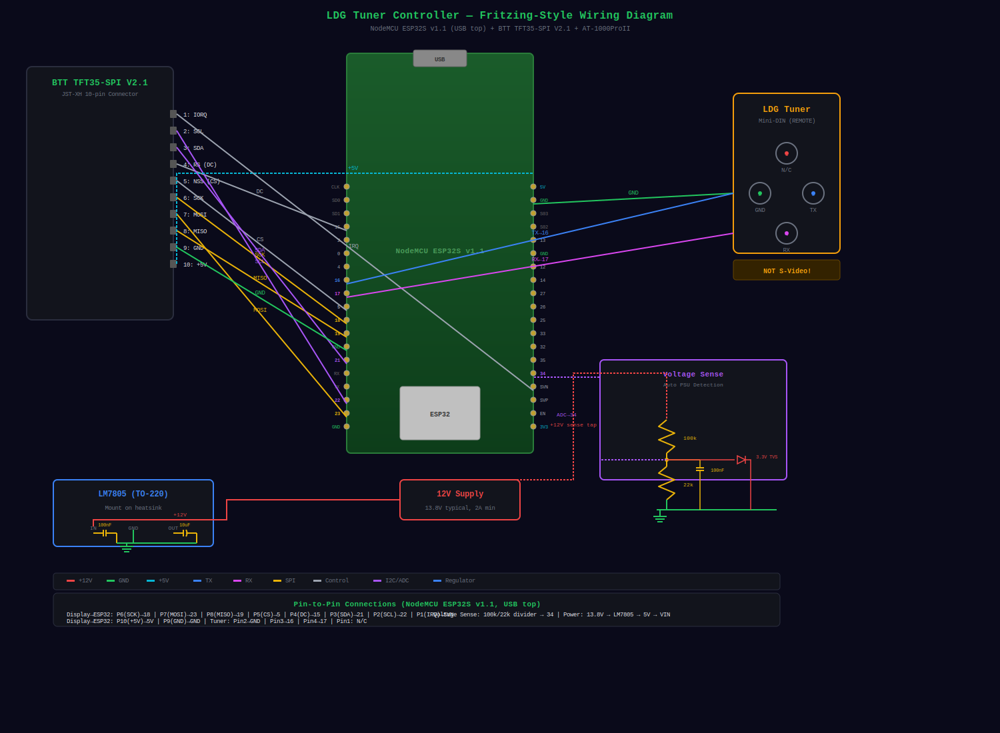

# Wiring Diagram



## ESP32 NodeMCU Pin Assignment

The graphical diagram above shows the complete wiring. For quick reference, here are the key pin assignments:

## Connection 1: Tuner TTL Interface (4-pin mini-DIN)

**CRITICAL**: The mini-DIN connector on the AT-1000ProII is NOT standard S-Video. Do NOT use an S-Video cable.

### Mini-DIN Connector Pinout (viewed from front, pins facing you)

| Pin | Signal | Connection |
|-----|--------|------------|
| 1 | N/C | Not connected |
| 2 | GND | ESP32 GND |
| 3 | TX | ESP32 GPIO 16 (tuner → ESP32) |
| 4 | RX | ESP32 GPIO 17 (ESP32 → tuner) |

### Tuner Wiring Summary

- **Pin 1**: N/C (not connected)
- **Pin 2**: GND → ESP32 GND
- **Pin 3**: TX → ESP32 GPIO 16
- **Pin 4**: RX → ESP32 GPIO 17

**Serial**: 38400 baud, 8N1, TTL (5V)

**Note**: If your ESP32 is 3.3V logic only, use a level shifter (e.g., TXS0108E or 74HCT245) between the ESP32 and tuner for reliable communication. Many ESP32 dev boards have 5V-tolerant GPIO.

## Connection 2: Power Supply

Power is supplied by a separate 12V DC source (13.8V typical, 2A minimum). An LM7805 linear regulator steps this down to 5V for the ESP32 and display. A linear regulator is preferred over a switching buck converter to avoid RF noise injection into your receiver.

**Thermal calculation:**
- Input: 12V (13.8V typical)
- Output: 5V
- Peak current: ~350mA (ESP32 WiFi TX + display)
- Dissipation: (13.8V - 5V) x 0.35A = **~3.1W**

A TO-220 package with a heatsink is required.

### Power Supply Circuit

```
12V Supply → [100nF] → LM7805 IN → LM7805 OUT → [10µF] → 5V
                          (heatsink)
```

- **Input**: 12V DC (13.8V typical, 2A minimum)
- **Regulator**: LM7805 (TO-220) with heatsink
- **Output**: 5V regulated for ESP32 and display
- **Input capacitor**: 100nF ceramic (place close to regulator input)
- **Output capacitor**: 10µF (place close to regulator output)
- **Dissipation**: ~3.1W at 350mA — heatsink required

## Connection 3: BTT TFT35-SPI Display

The display connects via a JST-XH 10-pin connector. The display uses SPI for the ILI9488 LCD and I2C for the NS2009 touch controller (separate buses).

### JST-XH 10-Pin Connector Pinout

| Pin | Signal | ESP32 Pin | Notes |
|-----|--------|-----------|-------|
| 1 | IORQ | GPIO 39 (SVN) | Touch interrupt (input only) |
| 2 | SCL | GPIO 22 | I2C clock (touch) |
| 3 | SDA | GPIO 21 | I2C data (touch) |
| 4 | RS (DC) | GPIO 15 | Data/command select |
| 5 | NSS (CS) | GPIO 5 | Display chip select |
| 6 | SCK | GPIO 18 | SPI clock |
| 7 | MOSI | GPIO 23 | SPI data in |
| 8 | MISO | GPIO 19 | SPI data out |
| 9 | GND | GND | Common ground |
| 10 | +5V | 5V | Regulated 5V supply |

### Touch Controller (NS2009 I2C)

The BTT TFT35-SPI V2.1 uses an NS2009 I2C touch controller at address 0x48. This is a separate bus from the display SPI — only SDA (GPIO 21), SCL (GPIO 22), and IRQ (GPIO 39) are needed.

### SPI and I2C Bus Summary

**SPI (Display):**
- GPIO 18 → Display SCK (P6)
- GPIO 23 → Display MOSI (P7)
- GPIO 19 → Display MISO (P8)
- GPIO 5 → Display NSS/CS (P5)
- GPIO 15 → Display RS/DC (P4)
- GPIO 32 → Display Backlight

**I2C (Touch):**
- GPIO 21 → Touch SDA (P3)
- GPIO 22 → Touch SCL (P2)
- GPIO 39 → Touch IORQ (P1)

## Connection 4: Voltage Sense (Optional)

Auto-detects the tuner's PSU voltage for accurate power calculation. Uses a voltage divider on GPIO 34 (ADC1_CH6, input-only).

### Voltage Divider Circuit

```
+12V → [100k] → GPIO 34 → [22k] → GND
                  │
                [100nF] (filter)
                  │
               [TVS 3.3V] (protection)
```

- **Divider ratio**: 5.545 = (100k + 22k) / 22k
- **ADC pin**: GPIO 34 (ADC1_CH6, input-only)
- **Valid range**: 8.0V - 18.0V (falls back to 13.8V default if out of range)

## Connection 5: Remote Unit (No Display)

Only the tuner TTL interface and power supply are needed.

- **12V Supply** → LM7805 → 5V → ESP32 5V
- **ESP32 GND** → Tuner Pin 2 (GND)
- **ESP32 GPIO 16** → Tuner Pin 3 (TX)
- **ESP32 GPIO 17** → Tuner Pin 4 (RX)

## Parts List

| Item | Qty | Notes |
|------|-----|-------|
| ESP32 WROOM dev board (NodeMCU) | 1-2 | NodeMCU ESP32S v1.1 |
| 4-pin mini-DIN connector | 1 | Kycon KMDLAX-4P or equivalent |
| LM7805 | 1 | 5V linear regulator, TO-220 |
| TO-220 heatsink | 1 | For LM7805 (~3.1W dissipation) |
| 100nF ceramic capacitor | 1 | Regulator input decoupling |
| 10µF capacitor | 1 | Regulator output stability |
| BTT TFT35-SPI display | 1 | For display unit only (ILI9488 + NS2009 touch) |
| Jumper wires | ~15 | Male-female for display, male-male for tuner |
| Level shifter (optional) | 1 | TXS0108E or 74HCT245 if 3.3V logic issues |

### Voltage Sense (optional)

| Item | Qty | Notes |
|------|-----|-------|
| 100k resistor | 1 | Voltage divider upper |
| 22k resistor | 1 | Voltage divider lower |
| 100nF ceramic capacitor | 1 | Filter |
| 3.3V TVS diode | 1 | GPIO protection |

## First-Time Setup

After flashing, the ESP32 creates a WiFi access point:

| Setting | Value |
|---------|-------|
| SSID | `LDGConfig` |
| Password | `configure` |

Connect to it — a captive portal will open for your home WiFi setup. Once connected to your network, access the web UI at the assigned IP.

## Assembly Notes

1. **Common ground**: All GND connections must be tied together (ESP32, tuner, display, regulator, 12V supply)
2. **Power supply**: Use a separate 12V DC supply (13.8V typical, 2A minimum). The LM7805 regulator requires a heatsink (~3.1W dissipation at 350mA).
3. **Regulator capacitors**: Place the 100nF ceramic close to the regulator input, and the 10µF close to the output. These are required for stability.
4. **Tuner connection**: The mini-DIN carries only GND, TX, and RX. Pin 1 is not connected.
5. **Level shifting**: The AT-1000ProII uses 5V TTL. Most ESP32 GPIO are 5V-tolerant, but if you get serial errors, add a level shifter.
6. **Display bus**: The display uses SPI (MOSI/MISO/SCK/CS/DC) and touch uses I2C (SDA/SCL/IRQ) — these are separate buses sharing only the ESP32.
7. **Backlight**: GPIO 32 controls backlight via PWM. Set to HIGH for full brightness.
8. **Touch IRQ**: GPIO 39 is input-only, which is fine for the touch interrupt line.
9. **RF considerations**: The linear regulator produces zero switching noise. Keep regulator leads short and use the capacitors as shown to prevent oscillation.
